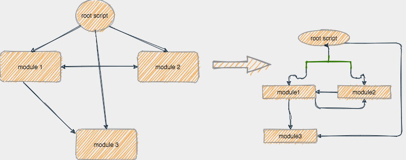

### 基本想法

> 基于tsc 的编译器，扫描入口js、ts文件，得到模块引用。并绘制成图表

```flow
start=>start: 开始、从入口文件进行扫描
checkModule=>condition: 检查是否有模块引用
pathFenxi=>operation: 路径分析、将文件路径记录到引用树中、加载模块文件
endScan=>operation: 结束扫描、将文件引用树进行遍历，将结果绘制到png图中
start->checkModule
checkModule(yes,right)->pathFenxi->checkModule
checkModule(no)->endScan
```

### 基本演示




